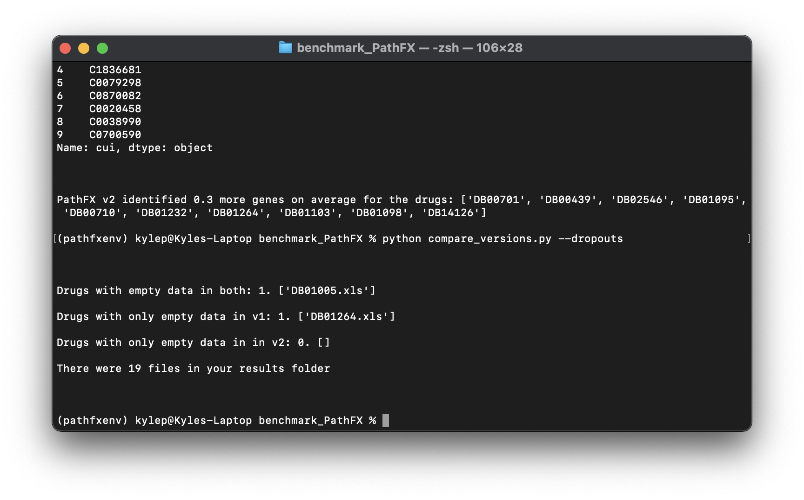

# benchmark_PathFX
Benchmarking performance on PathFX versions

A repository for code comparing PathFX outputs between versions, and eventually input data.

# Setup

Uses the same environment as [PathFX](https://github.com/jenwilson521/PathFX), but with xlrd and xlwt added so that the data can be exported and read to/from .xls spreadsheets.

Create a python 3.6 virtual environment (E.g. `conda create --name pathfxenv python=3.6`), activate it (`conda activate pathfxenv`), and then use `pip3 install -r requirements.txt` to install the required dependencies. Tested on miniconda 4.9.2.

# Usage

Running the script with no arguments or -h will give an overview of each of the arguments. The first time you run the script it will ask for paths to v1 and v2 of [PathFX](https://github.com/jenwilson521/PathFX). To get version 1.0 and 2.0 clone the respective branches. Whenever a test is ran it prints that specific test's output to the terminal window, and compiles all the tests to a .xls in the results folder next to the compare_versions.py. The spreadsheets in the results folder are used for calculating the droupouts.

Example of what the file structure looks like after running some tests:

### Compare specific drugs (--drugs)

Running compare_versions.py with -d or --drugs, and then a space seperated list of drugs will compare PathFX versions using the amount of genes each version identifies. It compares genes by default. For multi-word drugs put it in quotes. Examples: `python compare_versions.py -d metformin` and `python compare_versions.py -d metformin 'Quinidine barbiturate'`

- If only one drug is compared, data about the frequency of each gene/phenotype/gene with associated phenotype will be displayed, otherwise the script will find the average of how many more genes/phenotypes/gene with associated phenotypes that PathFX v2 found.

Example output for running `python compare_versions.py -d metformin`:

Example output for running `python compare_versions.py -d metformin 'Quinidine barbiturate'`:

### Compare random drugs (--random-drugs)

To compare random drugs use --random-drugs or -r and then a number. Example usage: `python compare_versions.py -r 2` will compare 2 randomly selected drugs. Genes are compared by default.

- If only one drug is compared, data about the frequency of each gene/phenotype/gene with associated phenotype will be displayed, otherwise the script will find the average of how many more genes/phenotypes/gene with associated phenotypes that PathFX v2 found.

Example output for running `python compare_versions.py -r 5`:

### Compare specific phenotypes (--compare-specific-phenotypes)

To compare a single drug while looking at specific phenotypes use --compare-specific-phenotypes or -csp. You can look at as many phenotypes as you want, just put them in a space sperated list. Needs to also be used with --drugs or --random-drugs. --csp will be ignored if it's used with more than one drug. Example usage: `python compare_versions.py -d metformin -csp "lipoprotein(a)"` or `python compare_versions.py -d metformin -csp "lipoprotein(a)" "hereditary hemochromatosis"`. Note that phenotype names need to be in quotes if they contain any special characters like spaces or parentheses. 

Example with `python compare_versions.py -d metformin -csp "lipoprotein(a)"`: 

## Compare dropouts (--dropouts)

Uses the calculated data in the results folder to see if CUI's are only in version one or version two of PathFX. 

Example with `python compare_versions.py --dropouts`: 

### Compare different data

- genes are compared by default
- to compare phenotypes use --phenotypes or -p. For example: `python compare_versions.py -d metformin -p`
- to compare genes with associated phenotypes use --genes-with-phenotype or -gwp. For example: `python compare_versions.py -d metformin -gwp`
- -p and -gwp can be used with --drugs and --random-drugs

### Used cached analyses (--cache)

If you know you have already analyzed a drug you can use --cache or -c to use the already computed data. Example: `python compare_versions.py -d metformin -c`. You can also use this when comparing random drugs, but it's unlikely you'll get the same drug over multiple random selections.

### Top amount (--top-amount)

When comparing a single drug by default only the top 10 most frequent genes/phenotypes/genes with associated phenotypes will be displayed. To change this you can use --top-amount or -t and then the amount of data you want to display. Example: `python compare_versions.py -d metformin -t 20` will display the top 20 most frequent genes instead of the top 10.

